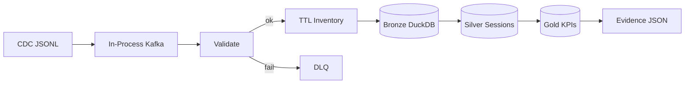
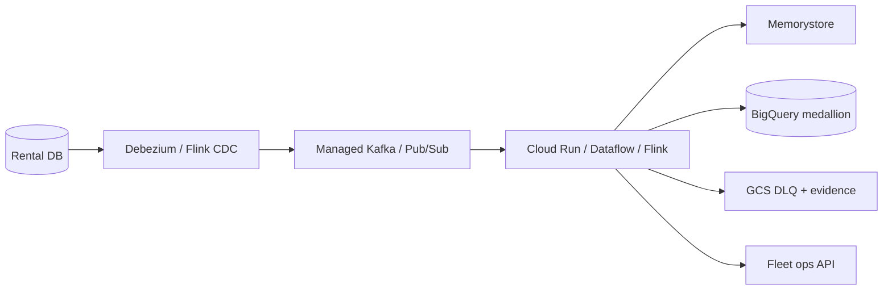

# Fleet Checkout Streaming Pipeline (GCP)

> **Compliance:** Redacted portfolio design of private production repos — full-scale sharing **prohibited under compliance**. See [COMPLIANCE.md](COMPLIANCE.md). Synthetic samples only.

Python stream-processing portfolio case study: ingest rental fleet CDC events, maintain live vehicle inventory in Redis, load bronze/silver/gold medallion tables, and compute booking conversion + fleet utilization KPIs. Local emulator with **GCP production mapping** (Debezium → Kafka → Memorystore → BigQuery).

Reference layout: [vishal-bulbule/etl-pipeline-datafusion-airflow](https://github.com/vishal-bulbule/etl-pipeline-datafusion-airflow) · [Python-for-GCP](https://github.com/vishal-bulbule/Python-for-GCP/tree/main/Python%20for%20GCP)

| Doc | Purpose |
|---|---|
| [docs/diagrams/DATA-MODEL.md](docs/diagrams/DATA-MODEL.md) | **ERD diagrams** — CDC events, medallion tables, streaming lineage |
| [docs/DESIGN.md](docs/DESIGN.md) | Architecture, schemas, failure matrix |
| [docs/HANDOVER.md](docs/HANDOVER.md) | Run / verify / handover checklist |
| [docs/gcp/GCP-SERVICES.md](docs/gcp/GCP-SERVICES.md) | GCP + GCS service mapping |
| [SOLUTION.md](SOLUTION.md) | Ask → code → expected output |
| [data/evidence/](data/evidence/) | Certified run metrics |

---

## Overview

1. **Ingestion** — Extract Debezium-style CDC from JSONL ([`cdc_jsonl.py`](codebase/fleet_streaming/ingestion/cdc_jsonl.py)); production: **Kafka / Pub/Sub**
2. **Validation** — Pydantic schema + DLQ quarantine ([`events.py`](codebase/fleet_streaming/schemas/events.py), [`dlq.py`](codebase/fleet_streaming/quality/dlq.py))
3. **Processing** — Live inventory TTL state, hold-expiry triggers ([`pipeline.py`](codebase/fleet_streaming/orchestration/pipeline.py)); production: **Memorystore Redis**
4. **Load** — Bronze UPSERT + silver sessions + gold KPIs ([`duckdb_loader.py`](codebase/fleet_streaming/warehouse/duckdb_loader.py)); production: **BigQuery medallion**
5. **Orchestration** — Run, certify, and gate quality ([`run_pipeline.py`](codebase/scripts/run_pipeline.py), [`certify_public_run.py`](codebase/scripts/certify_public_run.py)); production: **Cloud Composer / Flink**

---

## Architecture

**Local (this repo)**



**GCP production**



Detail: [docs/gcp/GCP-SERVICES.md](docs/gcp/GCP-SERVICES.md)

---

## Certified metrics (committed sample)

Artifact: [run_summary_index.json](data/evidence/run_summary_index.json)

| Metric | Result |
|---|---|
| Source → bronze | **200 / 200** |
| Fleet utilization KPI | **computed** |
| Booking conversion rate | **computed** |
| DLQ | **0** |
| Replay stable | **yes** · row count unchanged |
| Tests | **9 / 9** pass |

Analytics SQL: [analytics_query.sql](analytics_query.sql)

---

## Pipeline scripts

| Script | File |
|---|---|
| Extract | [`codebase/fleet_streaming/ingestion/cdc_jsonl.py`](codebase/fleet_streaming/ingestion/cdc_jsonl.py) |
| Transform | [`codebase/fleet_streaming/orchestration/pipeline.py`](codebase/fleet_streaming/orchestration/pipeline.py) |
| Load | [`codebase/fleet_streaming/warehouse/duckdb_loader.py`](codebase/fleet_streaming/warehouse/duckdb_loader.py) |
| Analytics | [`codebase/fleet_streaming/analytics/kpi.py`](codebase/fleet_streaming/analytics/kpi.py) |
| Orchestration | [`codebase/scripts/run_pipeline.py`](codebase/scripts/run_pipeline.py) |
| Certification | [`codebase/scripts/certify_public_run.py`](codebase/scripts/certify_public_run.py) |

Full command list: [commands.txt](commands.txt)

---

## Getting started

```powershell
cd fleet-checkout-streaming
py -3.12 -m pip install -r codebase\requirements.txt
$env:PYTHONPATH="codebase"
py -3.12 codebase\scripts\certify_public_run.py
py -3.12 -m pytest -q
```

Pass = certify exits **0**. Runbook: [codebase/scripts/HOW-TO-EXECUTE.md](codebase/scripts/HOW-TO-EXECUTE.md)

---

## Dataset

| Item | Link |
|---|---|
| Committed sample | `data/source/samples/fleet_rental_cdc.jsonl` (200 events) |
| Schema | [data-dictionary.md](data-dictionary.md) |
| Generator | [`codebase/scripts/generate_sample.py`](codebase/scripts/generate_sample.py) |

---

## Project structure

```
fleet-checkout-streaming/
├── README.md, commands.txt, analytics_query.sql
├── codebase/fleet_streaming/    # package
├── codebase/scripts/            # CLI entrypoints
├── docs/DESIGN.md, HANDOVER.md, gcp/GCP-SERVICES.md
├── data/source/samples/         # input
├── data/evidence/               # certified output
└── tests/
```

---

## License

Portfolio case study. Sample data is synthetic — no PII or production credentials.
