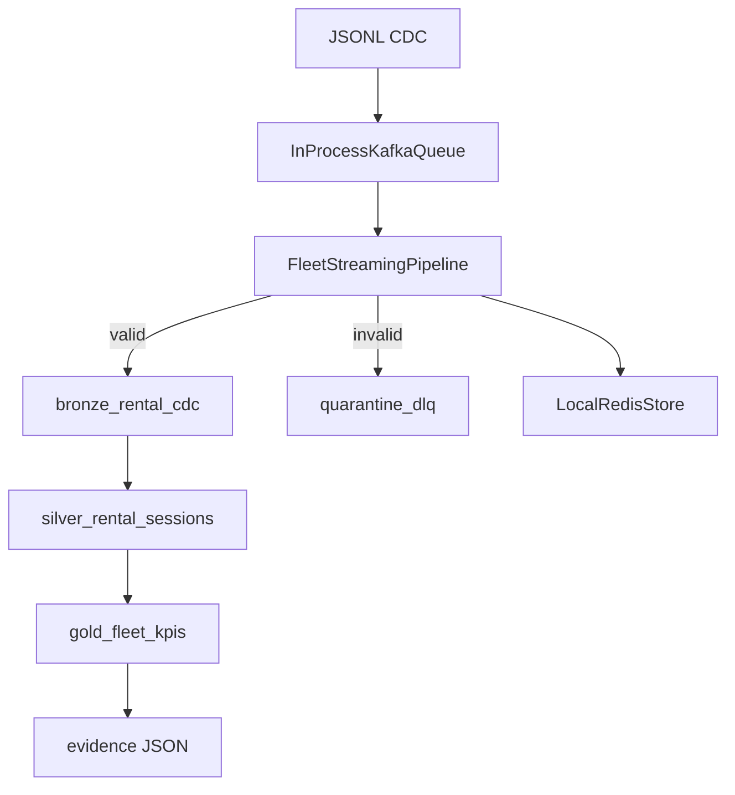

# Design Document — Fleet Checkout Streaming Pipeline

| Field | Value |
|---|---|
| **Status** | Implemented (local emulator) · **Proven** on 200-event sample via certification |
| **Standards** | [data-engineering-design-standards.md](standards/data-engineering-design-standards.md) |
| **Pre-merge gates** | [design-commit.md](standards/design-commit.md) |
| **Traceability** | [CONNECTIVITY.md](CONNECTIVITY.md) |
| **Code root** | `codebase/fleet_streaming/` |
| **Data root** | `data/source/` · `data/sink/` (runtime) · `data/evidence/` (proof) |
| **Entry points** | `run_pipeline.py`, `certify_public_run.py` |
| **Date** | 2026-09-14 |
| **Version** | 1.0.0 |

---

## 0. Pipeline outcomes (certified)

| Metric | Value | Proof |
|---|---|---|
| Source → bronze | 200 / 200 | `quality_gates.all_source_rows_ingested` |
| DLQ (sample) | 0 | `pipeline.dlq_files` |
| Fleet utilization KPI | computed | `gold_kpis.fleet_utilization_pct` |
| Booking conversion | computed | `gold_kpis.booking_conversion_pct` |
| Replay stability | 200 rows stable | `quality_gates.idempotent_replay_row_count_stable` |

Artifact: `data/evidence/run_summary_fleet_full_sample_*.json`

---

## 1. Verdicts

| # | Requirement | Verdict | Proof |
|---|---|---|---|
| V1 | Stream rental CDC to bronze | **Proven (local)** | 200/200 certification |
| V2 | Schema validation + DLQ | **Proven** | Synthetic: 2 DLQ; sample: 0 |
| V3 | Live inventory + hold expiry | **Proven (synthetic)** | `test_reservation_hold_trigger_fires_once` |
| V4 | Medallion silver/gold KPIs | **Proven** | `test_inventory_cache_and_conversion_kpi` |
| V5 | Idempotent replay | **Proven** | Certification + replay test |
| V6 | Checkpoint resume | **Proven** | `test_checkpoint_resume` |
| V7 | Reviewer evidence artifact | **Proven** | `data/evidence/run_summary_index.json` |
| V8 | Cloud-native scale-out | **Documented only** | `docs/gcp/GCP-SERVICES.md` |

---

## 2. Problem statement

### 2.1 Business problem

Car rental fleets operate across regions with **PostgreSQL rental DBs** emitting CDC. Operations teams need:

1. Live vehicle inventory (available / reserved / rented / maintenance)
2. Near-real-time booking conversion rates
3. Fleet utilization KPIs for capacity planning

Batch ETL cannot react to reservation hold expirations or intraday utilization swings.

### 2.2 Technical problem

Build a **local, reproducible emulator** of Flink-style CDC → Kafka → Redis → BigQuery medallion using Python, Pydantic, DuckDB, and a **committed 200-event JSONL sample** — verifiable without cloud spend or Docker.

---

## 3. Ask register

| ID | Ask |
|---|---|
| **A1** | Ingest rental CDC events into bronze lakehouse |
| **A2** | Validate schema; quarantine invalid rows to DLQ |
| **A3** | Maintain live inventory; fire hold-expiry trigger once |
| **A4** | Build silver sessions + gold utilization/conversion KPIs |
| **A5** | Support idempotent replay and checkpoint resume |
| **A6** | Publish certified run evidence for reviewers |

Full ASK → CODE → OUTPUT narrative: [SOLUTION.md](../SOLUTION.md).

---

## 4. Sources and sinks

### 4.1 Source — committed CDC sample

| Property | Value |
|---|---|
| Path | `data/source/samples/fleet_rental_cdc.jsonl` |
| Grain | One line = one CDC change event |
| Schema | [data-dictionary.md](../data-dictionary.md) |
| Idempotency key fields | `rental_id`, `event_time`, `event_type`, `vehicle_id`, `op` |

### 4.2 Source — synthetic QA

| Property | Value |
|---|---|
| Module | `ingestion/synthetic.py` |
| Purpose | Hold expiry + malformed rows for DLQ |

### 4.3 Sinks

| Sink | Path | Write mode | Idempotency key |
|---|---|---|---|
| Bronze | `warehouse.db` → `bronze_rental_cdc` | UPSERT | `cdc_id` |
| Silver | `silver_rental_sessions` | REPLACE by rental_id | `rental_id` |
| Gold | `gold_fleet_kpis` | full refresh | `metric_name` |
| DLQ | `data/sink/quarantine_dlq/*.json` | content-hash dedupe | payload hash |
| Redis | in-process | TTL + persistent | `inventory:{vehicle_id}` |
| Checkpoint | `data/sink/checkpoints/ingest.offset.json` | overwrite | source path + offset |
| Evidence | `data/evidence/run_summary_*.json` | append index | UTC timestamp |

---

## 5. Schemas

See [data-dictionary.md](../data-dictionary.md) for bronze/silver/gold column contracts.

Primary key: `cdc_id` = `deterministic_event_id(rental, time, type, vehicle, op)`.

---

## 6. Lineage

---

## 7. Failure matrix

| Node | Failure mode | Detection | Recovery |
|---|---|---|---|
| Ingestion | Malformed JSON line | JSON parse error (streamer) | Skip / fix source file |
| Validation | Invalid op or negative rate | Pydantic / DQ rule | Route to DLQ; stream continues |
| Kafka emulator | Empty topic | `get_next_event` returns None | End of batch; normal |
| Redis | TTL clock skew | Hold triggers delayed | Increase `ttl_wait_seconds` in run |
| DuckDB | Disk full | INSERT exception | Free disk; replay from checkpoint |
| Checkpoint | Source path change | Offset reset to 0 | Expected on new sample file |
| Gold KPI | Division by zero | SQL NULLIF | Returns 0.0 metric |

---

## 8. Test plan

| Test | Scenario | Expected |
|---|---|---|
| `test_deterministic_event_id_is_stable` | Idempotency key | Same hash on repeat |
| `test_synthetic_pipeline_idempotent_on_replay` | Replay synthetic | Same row + DLQ counts |
| `test_reservation_hold_trigger_fires_once` | Hold expiry | 1 trigger |
| `test_sample_loads_and_processes` | Happy path 25 rows | 25 bronze |
| `test_checkpoint_resume` | Offset resume | 20 bronze total |
| `test_inventory_cache_and_conversion_kpi` | Redis + gold | KPIs > 0 |
| `test_fleet_certification_script_passes` | Full certify subprocess | exit 0 |

---

## 9. Module map

| Module | Responsibility |
|---|---|
| `config/settings.py` | PipelineConfig dataclass |
| `schemas/events.py` | RentalCdcEvent Pydantic model |
| `ingestion/cdc_jsonl.py` | JSONL reader + Kafka streamer |
| `ingestion/kafka_queue.py` | In-process topic emulator |
| `ingestion/checkpoint.py` | Offset persistence |
| `ingestion/synthetic.py` | QA scenarios |
| `state/redis_store.py` | Inventory TTL store |
| `warehouse/duckdb_loader.py` | Bronze/silver/gold loader |
| `quality/dlq.py` | Dead letter quarantine |
| `orchestration/pipeline.py` | Main stream processor |
| `analytics/kpi.py` | Post-run KPI queries |
| `evidence/writer.py` | Certification JSON writer |

---

## 10. Document control

| Version | Date | Author | Change |
|---|---|---|---|
| 1.0.0 | 2026-09-14 | Portfolio scaffold | Initial design + local proof |
