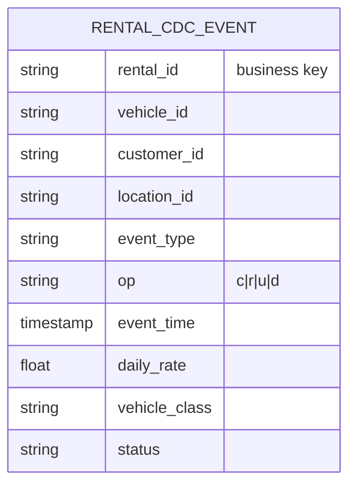
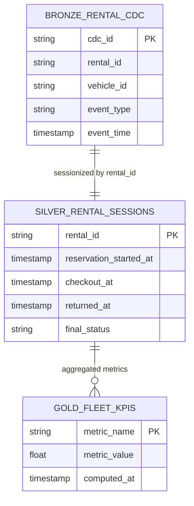
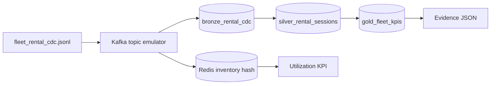
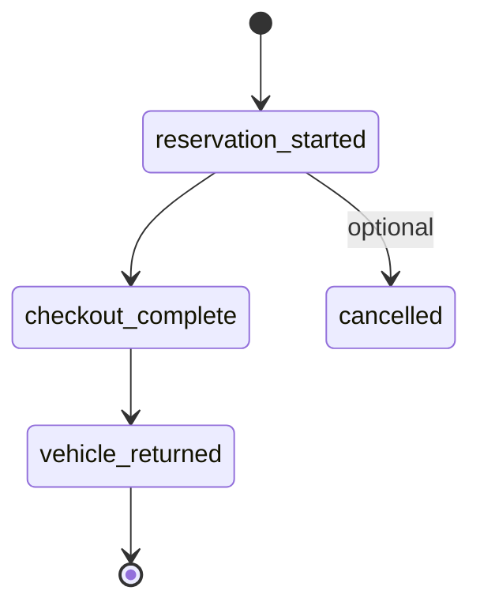

# Data Model & ERD — Fleet Checkout Streaming

CDC rental events → Kafka bus → DuckDB medallion + Redis live inventory.

Reference: [uber-data-engineering-mage-project](https://github.com/darshilparmar/uber-data-engineering-mage-project) data-model diagram pattern.

Cross-reference: [data-dictionary.md](../../data-dictionary.md) · [DESIGN.md](../DESIGN.md)

---

## 1. Source CDC event model

Each JSONL line is a Debezium-style change event on a rental/vehicle record.

**Grain:** one row = one CDC state change (not one rental session).

---

## 2. Medallion warehouse ERD

---

## 3. Streaming + inventory topology

Parallel paths: warehouse medallion and Redis live state.

---

## 4. Event lifecycle (rental session)

Session silver table collapses multiple CDC events into one row per `rental_id`.
